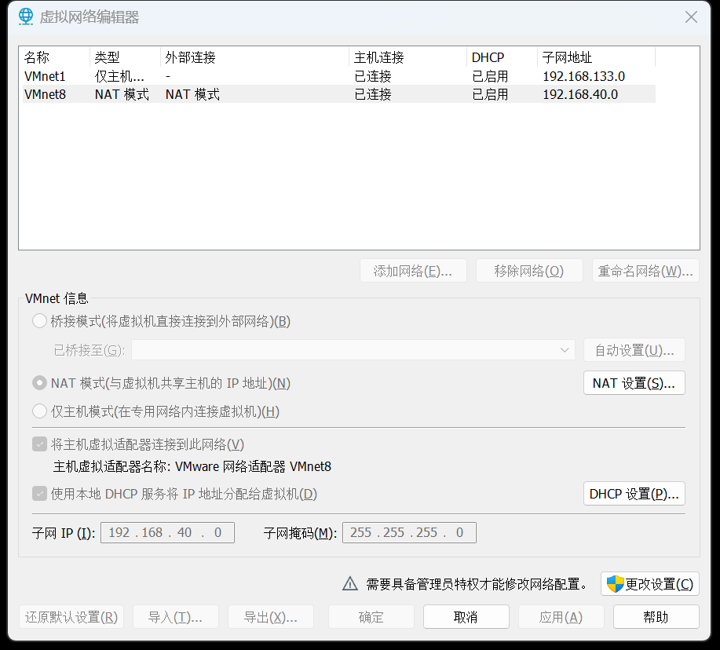
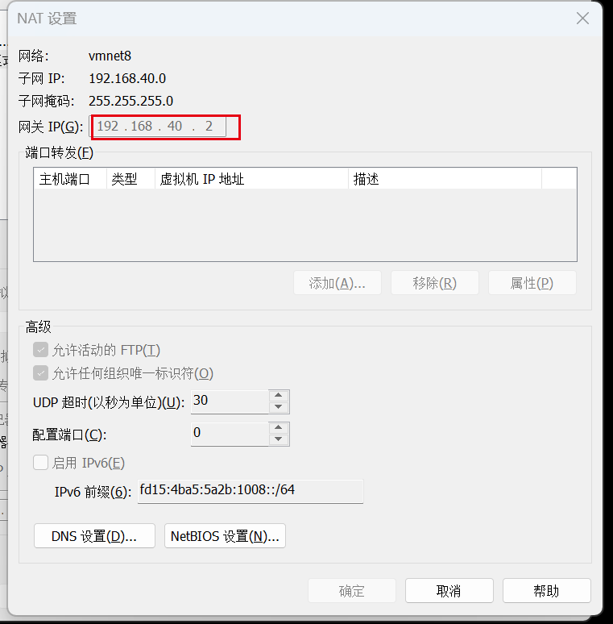
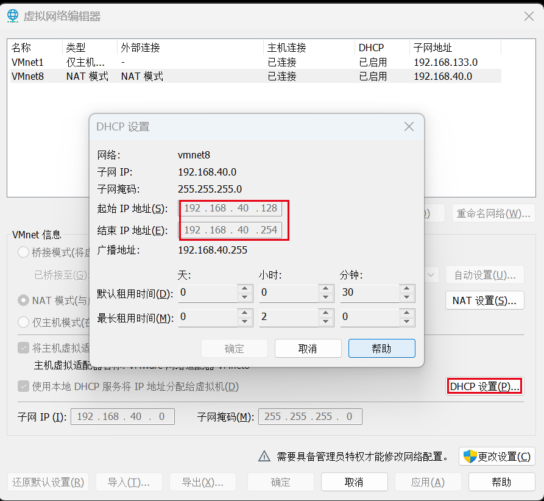
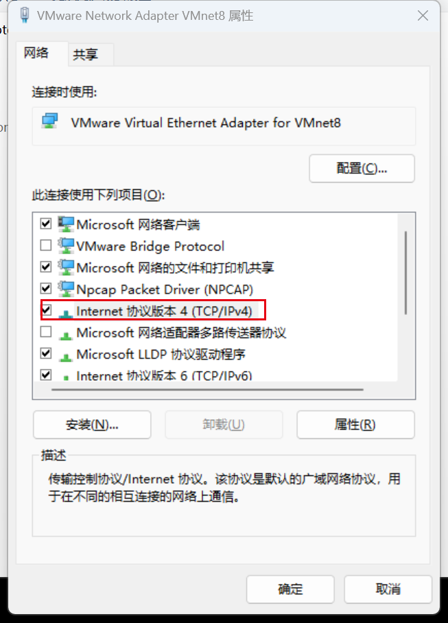
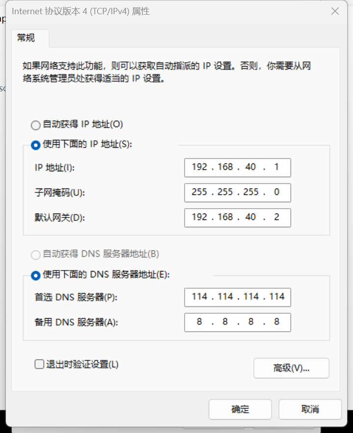
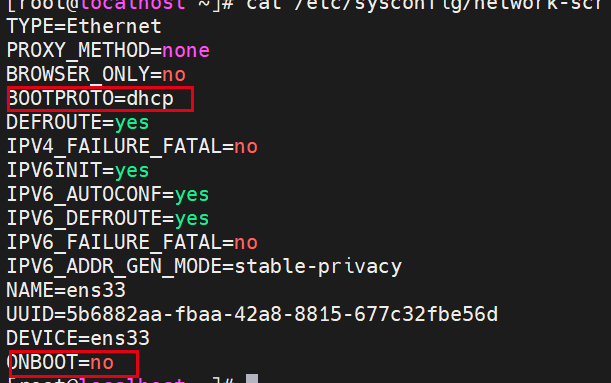

# 下载安装包
> 官方网站：[https://support.broadcom.com/group/ecx/downloads](https://support.broadcom.com/group/ecx/downloads)
>

注意：现在官网下载需要先登录才行。而且安装包也不需要许可证了，直接使用个人版即可。我这里使用的是之前已经下载好的。

之前下载的需要许可证，可以使用下面这些：

JU090-6039P-08409-8J0QH-2YR7F

ZF3R0-FHED2-M80TY-8QYGC-NPKYF

FC7D0-D1YDL-M8DXZ-CYPZE-P2AY6

ZC3TK-63GE6-481JY-WWW5T-Z7ATA

4A4RR-813DK-M81A9-4U35H-06KND

# 设置静态ip
安装vmware完成后，点击编辑->虚拟机网络编辑器，如下图所示：


将鼠标点到VMnet8上，点击NAT设置，可以看到网关为 **192.168.40.2**


然后点击取消，我们再看DHCP设置：


可以看到我们能设置的IP范围为 192.168.40.128-192.168.40.254。


然后双击TCP/IPv4，编辑属性如下：


+ IP地址：与默认网关网段保持一致，我的默认网关是**192.168.40.2**，所以IP为**192.168.40.1**，如果大家的网关是**192.168.50.2**，那么将IP设置为**192.168.50.1**即可。
+ 子网掩码：固定**255.255.255.0**
+ 默认网关：之前上面虚拟机网络编辑器中NAT设置弹窗中的网关
+ DNS：默认和我配置的一样就行

然后新建一个虚拟机，开始设置静态网络。

这里虚拟机的ip必须在刚才在虚拟机网络编辑器中的DHCP设置中规定的范围内，我这里使用 **192.168.40.128**

<font style="color:#DF2A3F;">注意：我这里使用的是centos7，以下设置静态ip都是基于centos7设置的。</font>

```bash
cd /etc/sysconfig/network-scripts
# 编辑前先备份以下
cp ifcfg-ens33 ifcfg-ens33.bak
vi ifcfg-ens33
```

编辑内容如下：

+ 修改前


+ 修改后

```plain
TYPE=Ethernet
PROXY_METHOD=none
BROWSER_ONLY=no
BOOTPROTO=static
DEFROUTE=yes
IPV4_FAILURE_FATAL=no
IPV6INIT=yes
IPV6_AUTOCONF=yes
IPV6_DEFROUTE=yes
IPV6_FAILURE_FATAL=no
IPV6_ADDR_GEN_MODE=stable-privacy
NAME=ens33
UUID=5b6882aa-fbaa-42a8-8815-677c32fbe56d
DEVICE=ens33
ONBOOT=yes
IPADDR=192.168.40.128
GATEWAY=192.168.40.2
NETMASK=255.255.255.0
DNS1=114.114.114.114
```

修改完成后需要重启下 network 使设置生效。

```plain
systemctl restart network
# ping宿主机
ping 192.168.40.1
# ping百度，测试网络是否可用
```

