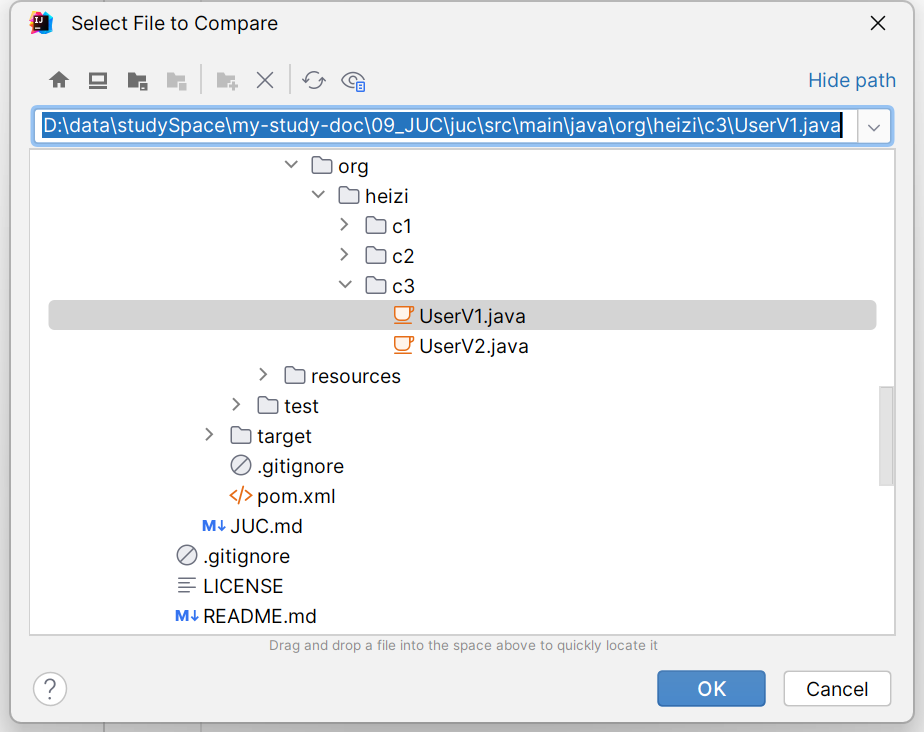

# 快捷键
| 说明 | 快捷键 | 补充说明 |
| --- | --- | --- |
| 批量修改变量/类名/方法名 | shift + F6 |  |
| 抽取代码作为一个方法 | ctrl + alt + M |  |
| 抽取代码作为一个静态类常量 | ctrl + alt + C |  |
| 抽取代码作为一个局部变量 | ctrl + alt + V |  |
| 重写父类方法 | ctrl + O |  |
| 实现接口方法 | ctrl + I |  |
| 选中部分切换大小写 | ctrl + shift + U |  |
| 批量导包/去除无用的包引用 | ctrl + alt + O |  |
| 显示方法参数提示信息 | ctrl + P |  |
| 格式化代码 | ctrl + alt + L |  |
| 显示try-catch等包围代码的选项 | ctrl + alt + T |  |
| 反向撤销 | ctrl + shift + Z |  |
| 剪贴板 | ctrl + shift + V |  |
| 复制并粘贴当前行 | ctrl + D |  |
| 删除光标所在行 | ctrl + Y |  |
| 将当前行在方法/类中往上移动 | ctrl + shift + ↑ |  |
| 将当前行在方法/类中往下移动 | ctrl + shift + ↓ |  |
| 查看上级类或上级方法 | ctrl + U |  |
| 查看方法调用链 | ctrl + alt + H |  |
| 查看方法继承链 | ctrl + shift + H |  |
| 查看类继承链 | ctrl + H |  |
| 标签页横跳 | alt + ←→ |  |
| 各种搜索 | shift + shift | tab 向右切换，shift + tab 向左切换 |
| 打开最近使用的文件 | ctrl + E |  |
| 查看选中的在哪些地方有被使用 | alt + F7 |  |
| 全局搜索 | ctrl + shift + F |  |
| 全局替换 | ctrl + shift + R |  |
| 多行编辑 | alt + shift + 鼠标点击 | 适用于光标位置竖向不对齐的情况 |
| 多行编辑 | shift + 鼠标下拉 | 适用于光标位置竖向对齐的情况 |
| 找到上一步编辑的位置 | ctrl + alt + ← | 回退 |
| 找到上一步编辑的位置 | ctrl + alt + → | 前进 |
| 快速定位到错误行 | F2 |  |
| 快速定位到项目窗口（Project） | alt + 1 | 左侧 Project 栏，重复快捷键关闭 |
| 快速定位到类目录（Structure） | alt + 7 | 左侧 Structure 栏，重复快捷键关闭 |
| 回到编辑器区域，关闭任何上层窗口 | Esc |  |
| 定位到类中上个方法 | alt + ↑ |  |
| 定位到类中下个方法 | alt + ↓ |  |
| 选取代码块 | ctrl + W |  |
| 减少选取代码块 | ctrl + shift + W |  |
| 代码补全 | ctrl + shift + enter | 类似给代码结尾加‘；’，if花括号补全等 |

上面这些是比较常用的一些快捷键，如果没有找到自己想用的快捷键可以在 IDEA 中按下`ctrl + shift + A`，输入 keyboard 点击下图标记的菜单，可以看到有一个 IDEA 提供的 pdf 格式的快捷键大全

# 好用插件
| 名称 | 说明 | |
| --- | --- | --- |
| GsonFormatPlus | 格式化json、根据json生成相应属性 快捷键：alt+s | |
| Alibaba Java Coding Guidelines | 阿里的代码规约检查 | |
| Key Promoter X | 日常开发熟悉快捷键的工具，如果一个操作可以使用快捷键使用但没有使用会有提示 | |
| LeetCode Editor | 力扣刷题插件 | |
| Rainbow Brackets | 通过不同颜色区分{}，（） | |
| RestfulTool | 根据接口快速定位controller位置的工具 | |
| Translation | 翻译工具，需要配合有道的applicationId使用 | |
| Material Theme UI | UI主题框架，可以替换idea的ui | |
| SequenceDiagram | 查看时序图，分析业务和源码时很好用 | |
| Presentation Assistant | 使用IDEA的快捷键时，下方会显示出使用的快捷键。录屏时好用 | |
| String Manipulation | 各种字符串操作（大小写，蛇形转驼峰，编码解码等），选中字符串后 alt + M | |
| mind map | 思维导图 | |
| mybatis x | Mapper 和 xml 双向跳转 | |
| maven helper | 用于解决maven依赖冲突的工具，在pom.xml文件中，文件下方点击 Denpendency Analyzer 栏使用 | |
| ApiPost Helper | ApiPost插件，可以将项目中的接口上传至ApiPost中，超级好用。 | |
| maven search | 查询常用的maven/gradle依赖直接复制 | |

# 便捷操作
## 历史版本
有时候我们修改了一个文件，然后清空后又重新写了一些东西，这时候想着恢复到清空前，就可以使用这个便捷操作啦。使用方法也非常简单，直接在文件中点击右键选中`show history...`，如下图所示：

## 比对
### 项目内文件比对
有时候我们需要知道项目中两个文件到底哪块不一样，这时候就可以在左侧 Project 栏中使用`ctrl + a`同时选中这两个文件，然后点击右键选择`compare files`，如下图所示：

我们也可以点击上面的箭头来选择覆盖哪个文件中不一样的地方。

### 项目间文件比对
有时候这两个文件不在同一个项目中，那也非常简单，只需要选中一个点击右键，选择`compare with`，然后在文件中指定另一个文件的位置即可，具体如下图所示：

### 剪贴板比对
有时候我们只想和我们复制的内容做比对，这种也很简单。比如我们要比对一串字符串是否一致，先复制字符串A，然后在 IDEA 中选中字符串B，然后右键`compare with clipboard`即可。

像这种我们只知道这两字符串确实不一样，但是我想知道哪个字符不一样，该怎么办呢？

其实也很简单，我就直接上图了。

# 多个Spring应用控制台侧列展示
正常我们启动多个Spring应用时，控制台展示如下：

这样切换多个应用比较麻烦，且不知道端口号。

可以点击 Services 中设置，Services位置如下：

点击 `Tool Windows`，选择右侧展开列中的`Services`（由于截图问题，这里截图不完整）。

找到`SpringBoot`列添加即可。

最终效果如下：

# 使用Material-ui卸载后，git状态颜色无法恢复。

一个一个Restore。

